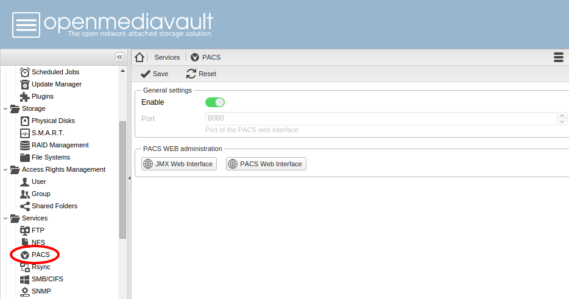
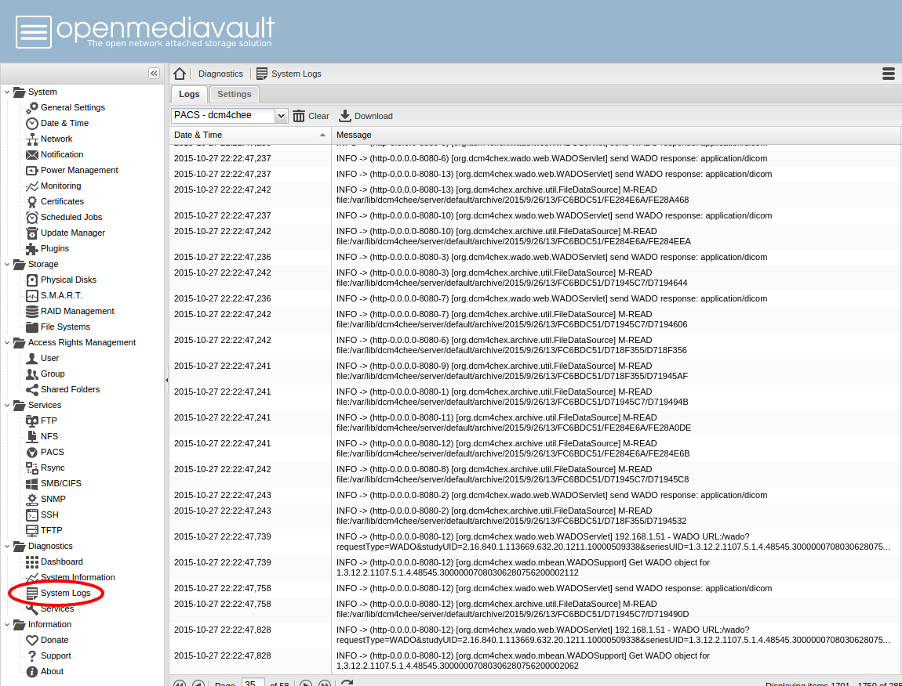

# OpenMediaVault plugin for dcm4chee and Weasis #

For installation on OpenMediaVault or on Debian-based distribution, see [wiki pages](https://github.com/nroduit/openmediavault-dcm4chee/wiki)

## PACS plugin in OpenMediaVault web interface ##

## PACS logs ##

The source does not contain the binaries of dcm4chee and weasis:

The binaries must be placed in 
* dcm4chee-mysql/var/lib/dcm4chee   
  |-- /bin   
  |-- /client   
  |-- /doc   
  ... (binaries of dcm4chee 2.18.3 and jboss-4.2.3.GA)   
 
* dcm4chee-mysql/var/lib/java-7-oracle   
  |-- /bin   
  |-- /db   
  |-- /include   
  ... (binaries of the latest Oracle jdk-7)   
  
* /weasis/var/lib/dcm4chee/server/default/deploy   
  |-- /weasis.war   
  |-- /weasis-ext.war   
  |-- /weasis-i18n.war   
  |-- /weasis-pacs-connector.war   
  |-- /dcm4chee-web-weasis.jar   
  (binaries of the latest weasis and weasis-pacs-connector 6.1.3 on sourceforge)   
  
